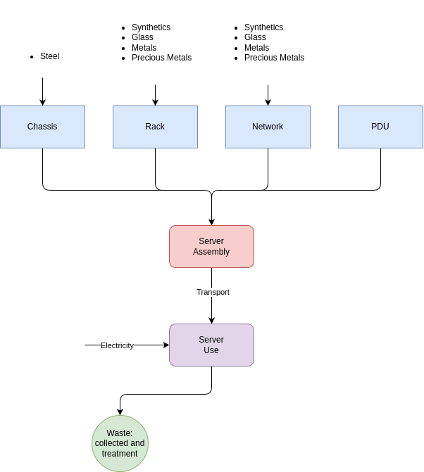

# Ecodesign - Project

- [Ecodesign - Project](#ecodesign---project)
  - [LCA - Processes](#lca---processes)
  - [Questions to ask the TA](#questions-to-ask-the-ta)

## LCA - Processes

## Questions to ask the TA

* How to model the fact we take one semester so 1/8 of the life cycle ?
  * Yes, I need to model let's say 300 laptops coming in each semesterqs
  * Keep logic value at different levels, typically model 1 laptop with 1 transport but then say icts use 300 new laptops for 3000*laptop energy
* How to model the transport then and so on
  * At process level
* End of life scenario, how to make sure the waste scenarios is okay
  * Create new waste type and tweak the values to make sure they are properly disposed
* Does the number seem okay ?
  * Send a draft now
* How to model recycling of screens and battery ?
  * Add new waste type

Do a sensitivity analysis, what if we replace this by that or not ?

For presenting, defend our choices, why we took this or that why not. they will have read the paper so no worries but just be sure to explain/

RECIPE method check google EIH